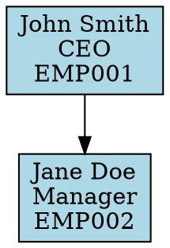

# Organizational Chart & Reporting Lines

The BackOffice package provides comprehensive organizational chart functionality that allows you to create and manage hierarchical staff relationships, generate various chart formats, and analyze organizational structure.

## Table of Contents

- [Overview](#overview)
- [Setting Up Staff Hierarchy](#setting-up-staff-hierarchy)
- [Generating Organizational Charts](#generating-organizational-charts)
- [Chart Formats](#chart-formats)
- [Statistical Analysis](#statistical-analysis)
- [Reorganization Suggestions](#reorganization-suggestions)
- [Exporting Charts](#exporting-charts)
- [API Reference](#api-reference)
- [Examples](#examples)

## Overview

The organizational chart system is built around the following key components:

- **Staff Model**: Supports supervisor/subordinate relationships
- **Company Model**: Provides company-wide chart generation
- **OrganizationalChart Helper**: Core utility for chart generation and analysis
- **Multiple Export Formats**: JSON, CSV, DOT (Graphviz)

## Setting Up Staff Hierarchy

### Basic Supervisor Relationships

```php
use AzahariZaman\BackOffice\Models\Staff;

// Create staff members
$ceo = Staff::create([
    'employee_id' => 'EMP001',
    'first_name' => 'John',
    'last_name' => 'Smith',
    'position' => 'Chief Executive Officer',
    'office_id' => $office->id,
    'status' => StaffStatus::ACTIVE,
    'is_active' => true,
]);

$manager = Staff::create([
    'employee_id' => 'EMP002',
    'first_name' => 'Jane',
    'last_name' => 'Doe',
    'position' => 'Department Manager',
    'department_id' => $department->id,
    'supervisor_id' => $ceo->id, // Reports to CEO
    'status' => StaffStatus::ACTIVE,
    'is_active' => true,
]);
```

### Validation and Safety

The system automatically prevents circular references:

```php
// This will throw an InvalidArgumentException
try {
    $ceo->setSupervisor($manager); // Would create circular reference
} catch (InvalidArgumentException $e) {
    echo $e->getMessage(); // "Cannot set supervisor: would create circular reference"
}
```

## Generating Organizational Charts

### Company-Wide Chart

Generate a complete organizational chart for a company:

```php
use AzahariZaman\BackOffice\Helpers\OrganizationalChart;

// Generate full company chart
$chart = OrganizationalChart::forCompany($company);

// Or use the company method
$chart = $company->getOrganizationalChart();
```

**Output Structure:**
```php
[
    'company' => [
        'id' => 1,
        'name' => 'Acme Corp',
        'code' => 'ACME001'
    ],
    'chart' => [
        // Nested hierarchy starting from top-level staff
        [
            'id' => 1,
            'employee_id' => 'EMP001',
            'name' => 'John Smith',
            'position' => 'CEO',
            'subordinates' => [
                // Direct reports with their own subordinates
            ]
        ]
    ],
    'metadata' => [
        'total_staff' => 150,
        'total_managers' => 25,
        'max_depth' => 5,
        'generated_at' => '2025-10-30T09:15:30Z'
    ]
]
```

### Staff-Specific Chart

Generate a chart starting from a specific staff member:

```php
$managerChart = OrganizationalChart::fromStaff($manager);
```

**Output Structure:**
```php
[
    'root_staff' => [
        'id' => 5,
        'name' => 'Jane Doe',
        'position' => 'Department Manager'
    ],
    'chart' => [
        // Hierarchy starting from this staff member
    ],
    'metadata' => [
        'team_size' => 12,           // Total subordinates
        'span_of_control' => 4,      // Direct reports
        'reporting_level' => 1,      // Distance from top
        'generated_at' => '2025-10-30T09:15:30Z'
    ]
]
```

## Chart Formats

### Flat Chart

Get a flat representation of all staff with their reporting relationships:

```php
$flatChart = OrganizationalChart::flatChart($company);
```

**Output:**
```php
[
    [
        'id' => 1,
        'employee_id' => 'EMP001',
        'name' => 'John Smith',
        'position' => 'CEO',
        'email' => 'john@company.com',
        'office' => 'Head Office',
        'department' => null,
        'supervisor' => null,
        'direct_subordinates_count' => 3,
        'total_team_size' => 149,
        'reporting_level' => 0
    ],
    // ... more staff
]
```

### Reporting Paths

Get the reporting path for each staff member to top management:

```php
$reportingPaths = OrganizationalChart::reportingPaths($company);
```

**Output:**
```php
[
    [
        'staff' => [
            'id' => 10,
            'name' => 'Alice Johnson',
            'position' => 'Developer'
        ],
        'path' => [
            ['name' => 'Alice Johnson', 'position' => 'Developer'],      // Self
            ['name' => 'Bob Manager', 'position' => 'Team Lead'],        // Direct supervisor
            ['name' => 'Jane Doe', 'position' => 'Department Manager'],  // Department head
            ['name' => 'John Smith', 'position' => 'CEO']                // Top level
        ],
        'path_length' => 3 // Number of levels to top (excluding self)
    ]
]
```

## Statistical Analysis

### Organizational Statistics

Get comprehensive statistics about the organizational structure:

```php
$stats = OrganizationalChart::statistics($company);
// Or use: $stats = $company->getOrganizationalStatistics();
```

**Output:**
```php
[
    'company' => [
        'id' => 1,
        'name' => 'Acme Corp'
    ],
    'totals' => [
        'total_staff' => 150,
        'total_managers' => 25,
        'top_level_executives' => 1,
        'individual_contributors' => 125
    ],
    'span_of_control' => [
        'average' => 5.2,
        'minimum' => 2,
        'maximum' => 12,
        'median' => 5.0
    ],
    'team_sizes' => [
        'average' => 15.8,
        'minimum' => 2,
        'maximum' => 149,
        'median' => 8.0
    ],
    'hierarchy_depth' => [
        'maximum_levels' => 5,
        'average_level' => 2.3,
        'level_distribution' => [
            0 => 1,   // Top level
            1 => 5,   // Level 1
            2 => 12,  // Level 2
            // ... etc
        ]
    ]
]
```

### Staff-Level Metrics

Individual staff members provide their own metrics:

```php
$staff = Staff::find(5);

// Hierarchy information
$ancestors = $staff->getAncestors();           // All supervisors up the chain
$descendants = $staff->getDescendants();       // All subordinates down the chain
$peers = $staff->getPeers();                   // Staff with same supervisor
$reportingPath = $staff->getReportingPath();   // Path to top management

// Metrics
$teamSize = $staff->getTeamSize();             // Total subordinates
$spanOfControl = $staff->getSpanOfControl();   // Direct reports only
$reportingLevel = $staff->getReportingLevel(); // Distance from top

// Checks
$isManager = $staff->isManager();              // Has subordinates
$isTopLevel = $staff->isTopLevel();            // No supervisor
$reportsTo = $staff->reportsTo($otherStaff);   // Reports to specific staff
$manages = $staff->manages($otherStaff);       // Manages specific staff
```

## Reorganization Suggestions

Get AI-powered suggestions for organizational improvements:

```php
$suggestions = OrganizationalChart::reorganizationSuggestions($company);
```

**Output:**
```php
[
    'company' => [
        'id' => 1,
        'name' => 'Acme Corp'
    ],
    'suggestions' => [
        [
            'type' => 'span_of_control_too_high',
            'description' => 'Some managers have more than 10 direct reports',
            'affected_managers' => [
                [
                    'id' => 5,
                    'name' => 'Overloaded Manager',
                    'position' => 'Department Head',
                    'direct_reports' => 15
                ]
            ],
            'recommendation' => 'Consider adding middle management or redistributing staff'
        ],
        [
            'type' => 'hierarchy_too_deep',
            'description' => 'Some staff are more than 6 levels from top management',
            'affected_staff' => [
                // Staff members with deep reporting chains
            ],
            'recommendation' => 'Consider flattening the organizational structure'
        ]
    ]
]
```

## Exporting Charts

### JSON Export (Default)

```php
$chart = OrganizationalChart::export($company, 'json');
// Returns the same structure as forCompany()
```

### CSV Export

Perfect for spreadsheet applications:

```php
$csv = OrganizationalChart::export($company, 'csv');
```

**Output Format:**
```csv
Employee ID,Name,Position,Email,Office,Department,Supervisor,Direct Reports,Team Size,Level
EMP001,"John Smith","CEO",john@company.com,"Head Office",,0,3,149,0
EMP002,"Jane Doe","Manager",jane@company.com,"Head Office","Engineering","John Smith",4,25,1
```

### DOT Export (Graphviz)

For creating visual diagrams with Graphviz:

```php
$dot = OrganizationalChart::export($company, 'dot');
```

**Output:**


Use with Graphviz to generate visual charts:
```bash
echo "$dot" | dot -Tpng -o orgchart.png
```

## API Reference

### OrganizationalChart Helper Methods

| Method | Description | Returns |
|--------|-------------|---------|
| `forCompany(Company $company)` | Complete company organizational chart | `array` |
| `fromStaff(Staff $staff)` | Chart starting from specific staff | `array` |
| `flatChart(Company $company)` | Flat list of all staff with metrics | `array` |
| `reportingPaths(Company $company)` | Reporting paths for all staff | `array` |
| `statistics(Company $company)` | Organizational statistics | `array` |
| `reorganizationSuggestions(Company $company)` | Improvement suggestions | `array` |
| `export(Company $company, string $format)` | Export in specified format | `array\|string` |

### Staff Model Methods

| Method | Description | Returns |
|--------|-------------|---------|
| `getAncestors()` | All supervisors up the chain | `Collection` |
| `getDescendants()` | All subordinates down the chain | `Collection` |
| `getReportingPath()` | Path from self to top management | `Collection` |
| `getPeers()` | Staff with same supervisor | `Collection` |
| `getTeamSize()` | Total number of subordinates | `int` |
| `getSpanOfControl()` | Number of direct reports | `int` |
| `getReportingLevel()` | Distance from top level | `int` |
| `isManager()` | Has subordinates | `bool` |
| `isTopLevel()` | No supervisor | `bool` |
| `reportsTo(Staff $staff)` | Reports to specific staff | `bool` |
| `manages(Staff $staff)` | Manages specific staff | `bool` |
| `setSupervisor(?Staff $supervisor)` | Set supervisor with validation | `Staff` |

### Company Model Methods

| Method | Description | Returns |
|--------|-------------|---------|
| `getOrganizationalChart()` | Company organizational chart | `array` |
| `getOrganizationalStatistics()` | Company statistics | `array` |
| `getAllStaff()` | All staff in company | `Collection` |
| `getTopLevelStaff()` | Staff without supervisors | `Collection` |

## Examples

### Complete Setup Example

```php
use AzahariZaman\BackOffice\Models\{Company, Office, Department, Staff};
use AzahariZaman\BackOffice\Enums\StaffStatus;
use AzahariZaman\BackOffice\Helpers\OrganizationalChart;

// Create company structure
$company = Company::create([
    'name' => 'Tech Solutions Inc',
    'code' => 'TSI001',
    'is_active' => true,
]);

$office = Office::create([
    'name' => 'Headquarters',
    'code' => 'HQ001',
    'company_id' => $company->id,
    'is_active' => true,
]);

$engineering = Department::create([
    'name' => 'Engineering',
    'code' => 'ENG001',
    'company_id' => $company->id,
    'is_active' => true,
]);

// Create staff hierarchy
$ceo = Staff::create([
    'employee_id' => 'EMP001',
    'first_name' => 'Sarah',
    'last_name' => 'Johnson',
    'position' => 'Chief Executive Officer',
    'email' => 'sarah.johnson@techsolutions.com',
    'office_id' => $office->id,
    'status' => StaffStatus::ACTIVE,
    'is_active' => true,
]);

$cto = Staff::create([
    'employee_id' => 'EMP002',
    'first_name' => 'Michael',
    'last_name' => 'Chen',
    'position' => 'Chief Technology Officer',
    'email' => 'michael.chen@techsolutions.com',
    'office_id' => $office->id,
    'supervisor_id' => $ceo->id,
    'status' => StaffStatus::ACTIVE,
    'is_active' => true,
]);

$devManager = Staff::create([
    'employee_id' => 'EMP003',
    'first_name' => 'Amanda',
    'last_name' => 'Rodriguez',
    'position' => 'Development Manager',
    'email' => 'amanda.rodriguez@techsolutions.com',
    'department_id' => $engineering->id,
    'supervisor_id' => $cto->id,
    'status' => StaffStatus::ACTIVE,
    'is_active' => true,
]);

// Generate and analyze charts
$fullChart = OrganizationalChart::forCompany($company);
$statistics = OrganizationalChart::statistics($company);
$suggestions = OrganizationalChart::reorganizationSuggestions($company);

// Export for external use
$csvData = OrganizationalChart::export($company, 'csv');
file_put_contents('org_chart.csv', $csvData);

$dotData = OrganizationalChart::export($company, 'dot');
file_put_contents('org_chart.dot', $dotData);
```

### Query Examples

```php
// Find all managers in the company
$managers = Staff::managers()->get();

// Find all top-level executives
$executives = Staff::topLevel()->get();

// Find staff at specific reporting level
$middleManagers = Staff::atLevel(2)->get();

// Get a manager's team
$teamMembers = $manager->getDescendants();

// Check reporting relationships
if ($employee->reportsTo($manager)) {
    echo "Employee reports to this manager";
}

// Find peers
$colleagues = $employee->getPeers();

// Get span of control for all managers
$managers = Staff::managers()->get();
foreach ($managers as $manager) {
    echo "{$manager->full_name}: {$manager->getSpanOfControl()} direct reports\n";
}
```

### Integration with Blade Templates

```php
// In your controller
public function orgChart(Company $company)
{
    return view('admin.org-chart', [
        'chart' => $company->getOrganizationalChart(),
        'statistics' => $company->getOrganizationalStatistics(),
        'csvExport' => route('org-chart.export', ['company' => $company, 'format' => 'csv']),
    ]);
}
```

```blade
{{-- In your Blade template --}}
<div class="org-chart">
    <h2>{{ $chart['company']['name'] }} - Organizational Chart</h2>
    
    <div class="stats">
        <div class="stat">
            <span class="label">Total Staff:</span>
            <span class="value">{{ $chart['metadata']['total_staff'] }}</span>
        </div>
        <div class="stat">
            <span class="label">Managers:</span>
            <span class="value">{{ $chart['metadata']['total_managers'] }}</span>
        </div>
        <div class="stat">
            <span class="label">Max Depth:</span>
            <span class="value">{{ $chart['metadata']['max_depth'] }} levels</span>
        </div>
    </div>
    
    <div class="export-links">
        <a href="{{ $csvExport }}" class="btn">Export CSV</a>
    </div>
    
    {{-- Render the hierarchical chart --}}
    @include('admin.partials.org-chart-node', ['nodes' => $chart['chart']])
</div>
```

The organizational chart system provides a robust foundation for managing and visualizing complex organizational structures, with built-in analytics and multiple export options for integration with external tools.